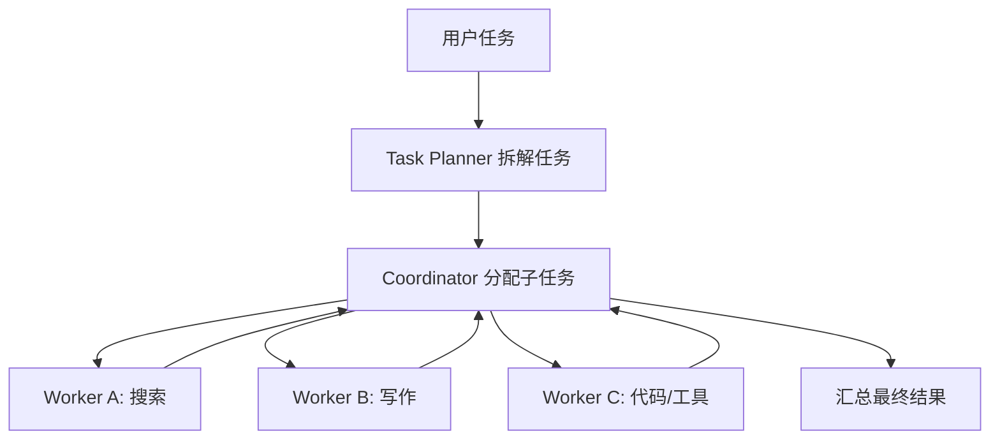
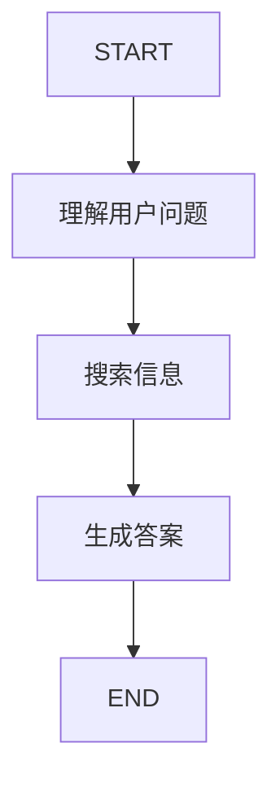
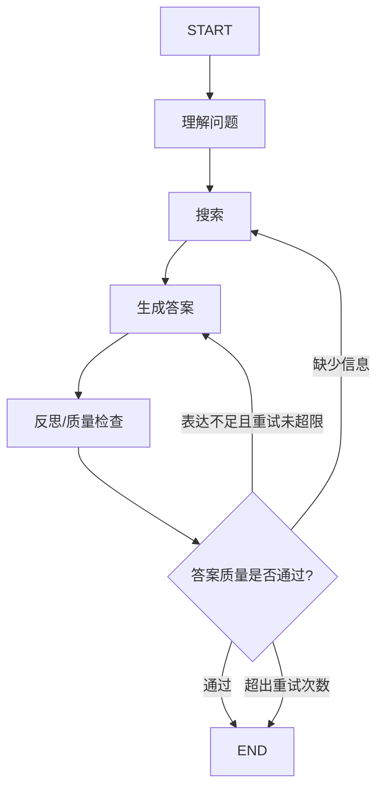
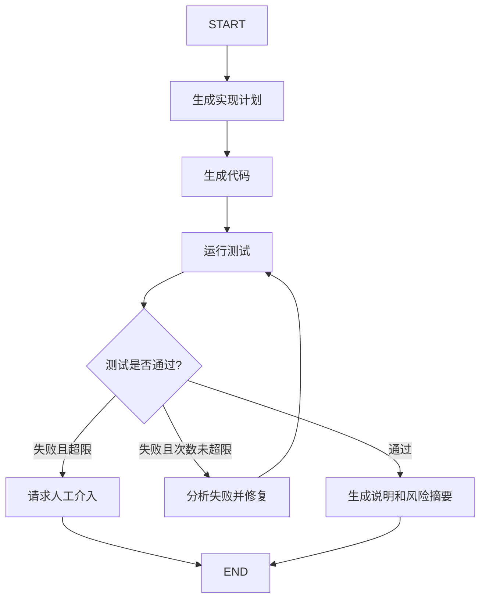

## 我的答案
1.1 略
1.2 类似于MBTI中的P人和J人，涌现式协作适合发散思维，创作，让AI自己来决定实现方法，直到完成目标，显式控制更佳适合现在工业上的稳定流程，更佳可控，AI只在关键节点帮助做决策，输出一个决定性的定义好的scope路由到既定的方向

2 AutoGen 跳过，微软已经转向MAF了

3.1 天然的异步操作，且MsgHub支持广播向特定的群体，而且天然可以多Hub，单Hub内还能不断交互迭代。在需要分角色，部分角色参与部分事务的场景下，不需要给所有的AI发送消息确认是否需要做这件事，只有需要的时候才会被通知到
3.2 略
3.3 略

4.1 略
4.2 略

5.1 略 已经问过Codex了
5.2 略 已经问过Codex了

6.1 AgentScope
6.2 CAMEL
6.3 LangGraph

## 参考点评和完善答案

### 对“我的答案”的点评

- `1.1 略` 会漏掉题目要求的“两个框架三维对比”。建议至少选 `AgentScope` 和 `LangGraph`，因为它们分别代表消息驱动多智能体和显式状态图控制，差异最清楚。
- `1.2` 用 MBTI 中 P/J 的类比有助于直觉理解，但正式答案里还应落到“可预测性、可审计性、状态控制、开放协作”这些工程维度。
- `2 AutoGen 跳过` 的判断是合理的，因为微软当前新项目路线已转向 Microsoft Agent Framework。但答案里最好说明：本题不展开 AutoGen API，只保留它“群聊式多智能体协作”的设计思想。
- `3.1` 对 `MsgHub` 的理解基本正确，尤其是“只通知相关角色”。还可以补充消息驱动带来的解耦、广播、异步、分布式、回放和审计能力。
- `3.2` 不能略，题目明确要求设计“猎人”的结构化输出模型。
- 第 6 题的选型方向基本正确：`AgentScope / CAMEL / LangGraph`。但应用 A 要补充：如果严格要求 1000+ QPS 和 2 秒 SLA，核心在线链路更适合传统服务/RAG 架构，AgentScope 更适合后台复杂工单或多角色升级流程。

## 更完善的参考答案

### 1. 框架对比与设计哲学

#### 1.1 AgentScope 与 LangGraph 对比

| 维度 | AgentScope | LangGraph |
|---|---|---|
| 协作模式 | 多 agent 消息驱动，适合多个角色在不同通信空间中协作，例如狼人夜聊、白天公聊 | 状态机/有向图驱动，节点执行任务，边决定流转 |
| 控制方式 | 通过 `Msg`、`MsgHub`、`Pipeline` 管理消息和参与者，流程可由代码控制，也可由 agent 互动产生 | 通过 `State`、`Node`、`Edge`、`Conditional Edge` 显式控制每一步 |
| 适用场景 | 多角色协作、仿真、游戏、分布式 agent 应用、需要消息隔离的场景 | 审批流、检索增强、代码生成-测试-修复、需要可审计和可恢复的流程 |

#### 1.2 涌现式协作与显式控制

涌现式协作是先定义角色、目标和通信规则，让 agent 在对话中自行形成解决方案。优点是灵活，适合创作、头脑风暴和开放探索；缺点是难预测、难调试，容易跑偏或陷入循环。

显式控制是开发者预先定义状态、节点、边和条件跳转。优点是稳定、可审计、适合生产流程；缺点是前期设计成本更高，开放性和创造性较弱。

可以粗略类比为：涌现式协作更像发散式协作，显式控制更像工业流程编排。真正落地时通常会混合使用：关键流程用显式控制，局部判断或创作交给 LLM。

### 2. AutoGen

AutoGen 本题不展开。原因是微软当前新项目路线已经转向 Microsoft Agent Framework，AutoGen 更适合作为“群聊式多智能体协作”的历史代表来理解，不建议在新项目中深入绑定其旧 API。

如果只保留设计思想，可以总结为：AutoGen 的核心价值在于把复杂任务拆成多个可对话角色，例如产品经理、工程师、审查员、测试工程师，然后通过群聊或 team 机制让角色按规则协作。

### 3. AgentScope 案例分析

#### 3.1 MsgHub 消息驱动的优势

消息驱动相比直接函数调用，最大的优势是解耦。发送者不需要知道接收者内部如何处理，只需要发送标准 `Msg`。在“三国狼人杀”中，狼人夜晚只进入狼人 `MsgHub`，所有玩家白天进入公共 `MsgHub`，不同角色看到的信息天然隔离。

这种架构特别适合：

- 多角色协作，不同角色只接收与自己相关的消息。
- 异步并发，多个 agent 可以并行响应同一个任务。
- 局部广播，例如狼人夜聊、专家小组讨论、审批小组复核。
- 分布式部署，agent 可以运行在不同进程或服务器上。
- 审计和回放，所有交互都可以记录成消息流。

#### 3.2 猎人结构化输出模型

```python
from typing import Optional, Literal
from pydantic import BaseModel, Field
from agentscope.agent import AgentBase


def get_hunter_model_cn(agents: list[AgentBase]) -> type[BaseModel]:
    class HunterActionModelCN(BaseModel):
        shoot: bool = Field(description="是否发动猎人开枪技能")
        target: Optional[Literal[tuple(agent.name for agent in agents)]] = Field(
            default=None,
            description="开枪目标。shoot 为 true 时必须选择存活玩家",
        )
        shoot_reason: Optional[str] = Field(
            default=None,
            description="开枪理由，应说明怀疑依据",
        )
        confidence_level: int = Field(
            ge=1,
            le=10,
            description="对该判断的信心程度",
        )

    return HunterActionModelCN
```

业务规则还应在代码中二次校验：只有猎人被投票出局时才能开枪；目标必须是存活玩家；不能选择自己；如果 `shoot=False`，则忽略 `target`。

#### 3.3 分布式实时游戏的挑战

分布式部署会带来消息顺序、状态一致性、网络延迟、节点失败、重复消息、权限隔离等问题。

可行做法包括：

- 服务端状态机作为唯一权威状态。
- 每条消息带全局递增序号、时间戳和房间 ID。
- 每个阶段设置超时，超时后默认跳过或使用兜底策略。
- 所有事件持久化到事件日志，方便恢复和回放。
- 消息处理必须幂等，避免重复投票或重复击杀。
- 私密信息只发送给对应 `MsgHub` 参与者，例如狼人夜聊只给狼人。

### 4. CAMEL 案例扩展

#### 4.1 终止分歧的冲突解决机制

如果一个 agent 认为 `<CAMEL_TASK_DONE>`，另一个 agent 不同意，可以加入第三方裁判或规则化仲裁：

1. 双方各自输出 `done / not_done`、理由和未完成清单。
2. 裁判 agent 根据验收标准判断是否完成。
3. 如果只是轻微问题，进入一次修改轮。
4. 如果连续 N 轮无法达成一致，转人工确认或输出部分完成结果。
5. 终止条件不只依赖魔法字符串，而应依赖结构化状态，例如 `status = done | revise | blocked`。

#### 4.2 Workforce 与群聊模式的区别

CAMEL 的 `Workforce` 更接近“组织化任务系统”，包含 coordinator、task planner、worker。planner 负责拆任务，coordinator 负责分配任务，worker 根据能力执行任务并返回结果。它不是所有 agent 在一个群里轮流聊天，而是层级化分派、执行、汇总。



与群聊模式相比，`Workforce` 更强调任务分解、角色分派和结果汇总；群聊模式更强调对话式协商和轮流发言。

### 5. LangGraph 案例扩展

#### 5.1 三步问答助手图结构



当前案例是线性图，没有真正使用条件边。搜索失败后的 fallback 是写在 `answer` 节点内部，而不是图层面的条件跳转。

#### 5.2 增加反思节点



示例条件边：

```python
from typing import Literal


def route_after_reflect(state) -> Literal["search", "answer", "__end__"]:
    if state["quality"] == "pass":
        return "__end__"
    if state["retry_count"] >= 3:
        return "__end__"
    if state["quality"] == "missing_info":
        return "search"
    return "answer"


workflow.add_conditional_edges(
    "reflect",
    route_after_reflect,
    {
        "search": "search",
        "answer": "answer",
        "__end__": END,
    },
)
```

这里的关键是：条件边最好基于结构化状态字段，例如 `quality`、`retry_count`，而不是从长文本里猜测下一步。

#### 5.3 更复杂场景：代码生成-测试-修复循环



关键状态字段包括：`task`、`code_diff`、`test_output`、`error_summary`、`attempts`、`final_report`。循环必须有最大次数，避免无限修复。

### 6. 框架选型

#### 应用 A：高并发智能客服系统

首选：从零开发轻量服务架构；如果必须在本章框架中选，则 `AgentScope` 最接近。

理由：1000+ QPS、2 秒响应、7×24 稳定运行更像传统后端/RAG 系统问题，需要缓存、限流、队列、监控、降级和水平扩展。多 agent 框架不应放在核心低延迟链路中。`AgentScope` 可用于后台复杂工单处理或多角色升级流程。

#### 应用 B：科研论文辅助写作平台

首选：`CAMEL`。

理由：研究员与写作智能体需要多轮深度讨论、角色分工、共同推进任务。`CAMEL` 的 RolePlaying 和 Workforce 更适合研究、写作、规划、资料整理这类开放式协作任务。

#### 应用 C：金融风控审批系统

首选：`LangGraph`。

理由：金融审批需要固定流程、条件分支、人工复核、可追溯、可审计。`LangGraph` 的状态图、条件边、checkpoint 和 human-in-the-loop 能更好地表达“资料审核 → 风险评估 → 额度计算 → 合规检查 → 人工复核 → 最终决策”的确定性流程。
